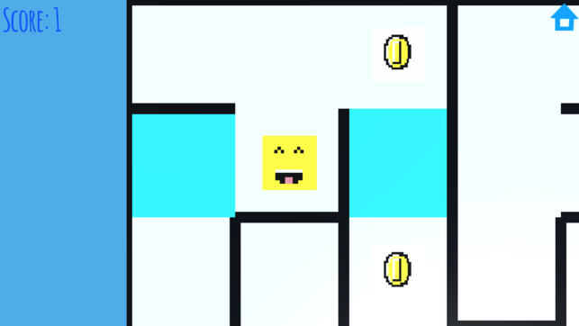

# Blocky Chase

Blocky Chase is a boundless chase where you have to solve the maze before your chaser catches up to you. In the maze, different tiles and power ups provide different advantages, so move carefully. But remember, the game gets harder as you level up. 

I made this during my Freshmen year of high school (Spring 2018). 

## HOW TO PLAY

Move the player from the bottom left corner to the top right corner. Access the help section in the game menu for more clarification.

## GREAT INTERACTIVITY

In order to play, swiping and taping allow the player to move from spot to spot in the maze. Also, a straightforward UI structure will help players access different game features.

## GAME FEATURES

The game involves many features, including a shop where you can customize the player, different control options, and provided statistics that help you better cope with the game.

## USEFULNESS OF THE GAME

The upbeat and exciting environment of the game provides satisfaction to anyone, no matter who you are and how your day is going. Blocky Chase is the perfect game for lifting your spirits while providing a challenge.

## CONCEPTS

- Generating mazes
- Path-finding algorithms
- Sprite design
